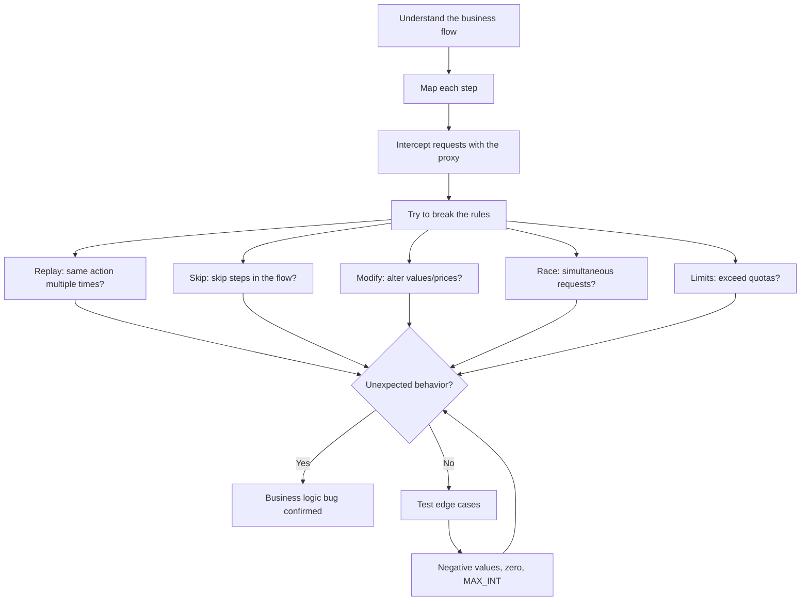

# Business Logic Bugs (Web)

## Overview

Business logic bugs are design flaws in how an application works. They are not technical errors but business rules that can be broken. They are among the best-paid bugs in bug bounty because they directly affect money, system integrity, and business processes. No automated scanner finds them; they require critical thinking and a deep understanding of the application.

## Impact

- **Medium**: Abuse of non-critical features, bypass of minor restrictions
- **High**: Multiple discount application, skipping verification steps, limit abuse
- **Critical**: Purchases without payment, price manipulation, duplicated refunds, direct financial loss

## Where to look

Mindset: **"How should this work, and how can I break it?"**

- Checkout / payment flows
- Coupons / discount codes
- Subscription / billing systems
- Refund flows
- Account limits (quotas, trials)
- Booking / reservation systems
- Rewards / loyalty programs
- Voting / rating systems
- Approval workflows
- Any multi-step flow

## Test methodology

### Test flow



### Detailed steps

1. **Understand the flow**: use the application as a normal user and map each step.
2. **Intercept**: capture all requests in the flow.
3. **Replay**: send the same request multiple times (coupon, refund).
4. **Skip**: jump straight to `POST /checkout` without prior steps.
5. **Modify**: change `price=100` -> `price=1`, `quantity=1` -> `quantity=-1`.
6. **Race**: simultaneous requests for actions that should be unique.
7. **Limits**: multiple sessions/accounts to bypass limits.

## Payloads

### Value modification

```http
# Original price
POST /checkout HTTP/1.1
{"item_id": "123", "price": 100, "quantity": 1}

# Price manipulation
POST /checkout HTTP/1.1
{"item_id": "123", "price": 1, "quantity": 1}

# Negative quantity (inverse credit)
POST /checkout HTTP/1.1
{"item_id": "123", "price": 100, "quantity": -1}

# Negative value in a transaction
POST /transfer HTTP/1.1
{"amount": -100, "to_account": "attacker"}
```

### Step skipping

```http
# Skip to checkout without adding an item to the cart
POST /checkout HTTP/1.1
{"order_id": "abc", "payment_status": "paid"}

# Skip payment verification
POST /order/complete HTTP/1.1
{"order_id": "abc"}
```

### Coupon abuse

```http
# Apply a coupon multiple times
POST /apply-coupon HTTP/1.1
{"code": "SAVE20"}
# Repeat N times

# Coupon in a different checkout
POST /apply-coupon HTTP/1.1
{"code": "SAVE20", "cart_id": "456"}
```

### Limit bypass

```http
# "1 per user" - test with:
# 1. Multiple simultaneous requests (race condition)
# 2. Multiple sessions
# 3. Change user-agent/IP
# 4. Create a second account
```

## Common bypasses

| Technique | Description | When to use |
|-----------|-------------|-------------|
| Request replay | Resend an identical request N times | "Once only" actions |
| Step skipping | Jump to the final endpoint without steps | Multi-step flows |
| Parameter manipulation | Alter price, quantity, status | Weak server-side validation |
| Negative values | Send `-100` as amount | Invert the money flow |
| Race condition | Simultaneous requests | Atomic actions without a lock |
| Session switching | Use session A in a session-B request | Per-session verification |
| Boundary testing | 0, -1, MAX_INT, empty | Unvalidated edge cases |

## Tools

- Caido/Burp - Proxy, Replay/Repeater, Automate/Intruder for all techniques
- Turbo Intruder - Parallel requests for race conditions
- Browser DevTools - Observe the client-side flow and JS validations

## Real examples

### Duplicate coupon
A site allows 1 coupon of 20% per order. Replaying `POST /apply-coupon` 5 times yields 100% off. Free purchase.

### Double refund
`POST /refund` sent twice rapidly. Both processed. The user receives $200 refund for a $100 purchase.

### Skip payment
Flow: cart -> payment -> confirmation. The attacker calls `POST /order/complete` directly without going through payment. The order is confirmed without paying.

### Negative transfer
A transfer API accepts `amount=-100`. Instead of debiting, it credits $100 into the attacker's account.

## Report tips

- **Calculate exact financial impact**: "$X loss per transaction, scalable to $Y".
- Show the normal flow vs the exploited flow side by side.
- Emphasize that scanners do not detect it; it is a design flaw.
- Recommend server-side validation and atomic transactions.
- If a race condition is involved, include timing evidence.
- Document each reproduction step clearly.
- Mention the attack's scalability (it can be automated).

## Defenses (context for the report)

| Defense | Description |
|---------|-------------|
| Server-side validation | Never trust client data |
| Atomic transactions | Composite operations in a single transaction |
| Idempotency keys | Prevent duplicate processing |
| Workflow enforcement | Validate step order on the backend |
| Business rule engine | Centralized, tested business rules |
| Monitoring/alerting | Detect anomalous usage patterns |

## References

- [[testing-financial-webapps]]
- OWASP Business Logic Testing: https://owasp.org/www-project-web-security-testing-guide/latest/4-Web_Application_Security_Testing/10-Business_Logic_Testing/
