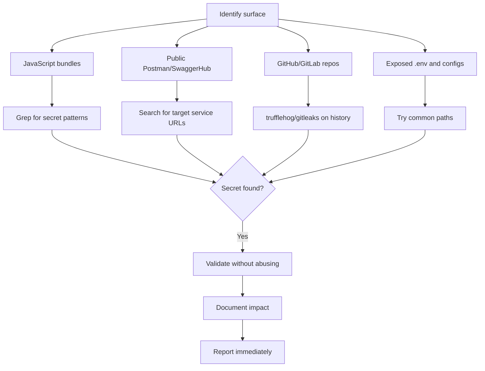

# Secrets Exposure

## Overview

Secrets exposure is the leakage of credentials, API keys, tokens, private keys, and other sensitive data in publicly reachable sources. It occurs in JavaScript files, Git repositories, collaboration tools (Postman, SwaggerHub), shortened public URLs, exposed environment variables, and forgotten development artifacts.

## Impact

- **Typical CVSS**: 5.0 - 9.8 (Medium to Critical, depending on the secret type and access level)
- **Technical impact**: Unauthorized access to APIs, databases, cloud infrastructure, third-party services
- **Business impact**: Compromise of customer data, financial fraud (payment keys), IP exfiltration, lateral pivot
- **Typical bounty**: $500 - $10,000+ (a cloud key with broad access = Critical)

## Where to look

### JavaScript files
- Minified bundles of web applications
- Exposed source maps (`.js.map`)
- JS files on dev/staging subdomains
- `utils.js`, `config.js`, old files

### Collaboration tools
- **Postman**: public collections and environments; search for specific service URLs
- **SwaggerHub**: API documentation with credentials in examples
- **GitHub**: historical commits, committed `.env`, GitHub Actions secrets

### Other vectors
- Shortened URLs (bit.ly, etc.) - enumerate sequential IDs
- `.env` files exposed on web servers
- Public Docker images with hardcoded secrets
- CI/CD pipelines with public build logs
- Verbose error messages with stack traces containing credentials
- Environment variables reachable via SSRF/RCE

## Test methodology



### 1. Search for secrets in JavaScript

```bash
# JWTs
grep -oE 'eyJ[A-Za-z0-9_-]{10,}\.[A-Za-z0-9_-]{10,}\.[A-Za-z0-9_-]{10,}' app.js

# AWS keys
grep -oE 'AKIA[A-Za-z0-9]{16}' app.js

# Stripe
grep -oE 'sk_live_[0-9a-zA-Z]{24}' app.js
grep -oE 'pk_live_[0-9a-zA-Z]{24}' app.js

# GitHub PAT
grep -oE 'ghp_[A-Za-z0-9]{36}' app.js

# GitLab token
grep -oE 'glpat-[A-Za-z0-9\-]{20}' app.js

# Google API keys
grep -Eo 'AIza[0-9A-Za-z\\-_]{35}' app.js

# Generic secrets
grep -iE 'apikey|api_key|secret|password|token|auth|bearer|credential' app.js
```

### 2. Search in public Postman

- Access the public Postman search.
- Search for the target's service URLs (e.g. `login.microsoftonline.com`, `api.target.com`).
- Examine: environment variables, auth config, helper scripts, saved examples.
- Secrets are not only in the requests; they are in the supporting materials.

### 3. Scan Git repositories

```bash
# TruffleHog (most robust scanner)
trufflehog git https://github.com/target/repo --only-verified

# Gitleaks
gitleaks detect --source ./repo --verbose

# Check history
git log --all --diff-filter=D -- "*.env"
git log --all -p -- "*secret*" "*key*" "*token*"
```

### 4. Check common .env paths

```
/.env
/.env.bak
/.env.old
/.env.production
/.env.staging
/.env.local
/config.json
/config.yml
/.aws/credentials
```

### 5. Validate found secrets

- **API keys**: make a minimal request (e.g. list 1 resource) to confirm it works.
- **JWTs**: decode at jwt.io, check claims (role, exp, permissions).
- **AWS keys**: `aws sts get-caller-identity` to confirm access.
- **Never**: modify data, exfiltrate information, escalate beyond what is needed to demonstrate impact.

## Payloads

### Consolidated regex patterns

```bash
# High-confidence patterns
AKIA[0-9A-Z]{16}                          # AWS Access Key
sk_live_[0-9a-zA-Z]{24}                   # Stripe Secret Key
ghp_[A-Za-z0-9]{36}                       # GitHub PAT
glpat-[A-Za-z0-9\-]{20}                   # GitLab Token
AIza[0-9A-Za-z\-_]{35}                    # Google API Key
xox[baprs]-[0-9a-zA-Z]{10,}              # Slack Token
sq0csp-[0-9A-Za-z\-_]{43}                # Square OAuth Secret
eyJ[a-zA-Z0-9-_=]+\.[a-zA-Z0-9-_=]+\.?   # JWT
SG\.[a-zA-Z0-9]{22}\.[a-zA-Z0-9-_]{43}    # SendGrid API Key
re_[a-zA-Z0-9]{32}                        # Resend API Key
sntrys_ey[a-zA-Z0-9]{50,}                 # Sentry Auth Token
```

### Search dev notes with secrets

```bash
grep -iE "todo|fixme|bug|devNote|debug|hack|@deprecated" js_files/*
grep -iE "remove before prod|temporary|test key|staging" js_files/*
```

## Common bypasses

| Protection | How to bypass |
|------------|---------------|
| Secrets in env vars (not in code) | SSRF to cloud metadata; RCE for `env` |
| Key rotation | Old secrets in Git history, Postman forks |
| Pre-commit scanners | Secrets in source maps (not committed directly) |
| .gitignore for .env | File already committed in earlier history |
| Private Postman workspace | Collections forked to a public workspace |

## Tools

| Tool | Function |
|------|----------|
| trufflehog | Robust secrets scanner (Git, S3, filesystems, JS) |
| gitleaks | Secrets scanner for Git repositories |
| secretfinder | Search for secrets in JS files |
| jsluice | Extraction of secrets + endpoints from JS |
| nuclei (secrets templates) | Templates for detecting .env, exposed secrets |
| Postman (public search) | Search for collections with credentials |

## Real examples

- Dozens of secrets found in public Postman over 18 months of monitoring across many mid-to-large organizations. Secret + executable requests + context = high-impact reports.
- A search for `login.microsoftonline.com` in Postman surfaced credentials for a Microsoft instance.
- A JS endpoint on a dev subdomain returned an admin JWT without authentication -> full admin-panel access.
- 230+ env vars (AWS, Stripe, GitHub, OpenAI, DB credentials) exfiltrated via a JS sandbox bypass (RCE).
- A staging API key still active in an old utils.js -> access to Swagger with every endpoint.

## Report tips

1. **Validate without abusing**: confirm the secret works with a minimal request, document, do not escalate.
2. **Report immediately**: active secrets should be reported urgently, given the risk of third-party exploitation.
3. **Classify the secret**: an admin-level cloud key = Critical; a read-only Maps key = Low.
4. **Document context**: where it was, how you found it, what the secret allows access to.
5. **Suggest rotation**: recommend immediate rotation + removal from the source + future prevention.

## Exposed Git - techniques

### Detection

```bash
# httpx probe
httpx -path "/.git/HEAD" -mc 200 -o git_exposed.txt

# nuclei
cat subs.txt | nuclei -t cves/git-exposed.yaml -o results.txt

# git-dumper - download the repository
git-dumper https://target.com/.git/ ./dumped-repo
```

### Post-dump exploitation

```bash
# List deleted files
git log --diff-filter=D --summary | grep delete

# History of a specific file
git log --diff-filter=D --stat -- path/to/file

# Restore a file from a deleted commit
git checkout <commit_hash>^ -- path/to/file
```

## Additional tools

- leakprowl - search for sensitive data across subdomain lists
- misconfig-mapper - detects misconfigurations in third-party services
- trivy - secrets scan for Git repositories and filesystems

## Sensitive files via the Wayback Machine

Historical snapshots reveal removed keys and endpoints:

```bash
# Collect historical URLs
curl "https://web.archive.org/cdx/search/cdx?url=*.example.com/*&output=text&fl=original&collapse=urlkey" > urls.txt

# Filter for valuable files
grep -E "\.env|\.sql|\.zip|\.tar\.gz|\.pdf|\.log|\.git|\.bak|/admin|/test" urls.txt
```

**"404 that is not a 404" tip:** the CDX index may list URLs as 404, but the Wayback timeline may still have a reachable snapshot.

## References

- [[api-key-exposure]] (secrets in JS bundles)
- [[dependency-confusion]] (related repository-exposure technique)
